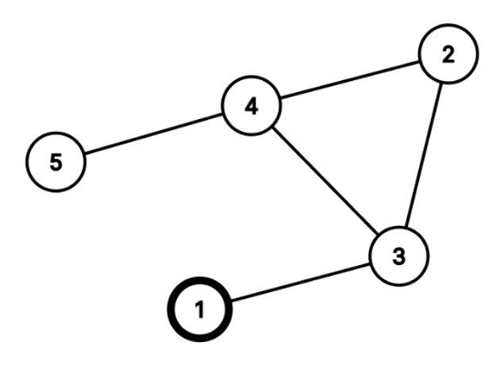
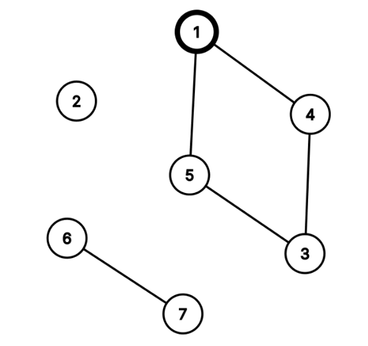

# 문제
"발 없는 말이 천 리 간다"는 옛말이 있듯, 한 번 퍼져나가기 시작한 소문은 막을 수 없이 퍼져나간다. <br/>
구름이는 N 명의 친구가 있고, 그 친구들 중에는 M 쌍의 친구 관계가 있다. <br/>구름이가 만약 어떤 친구에게 소문을 퍼뜨리게 된다면, 그
소문은 친구의 친구, 친구의 친구의 친구... 를 타고 퍼져나갈 것이다.
구름이가 1번 친구에게 소문을 퍼뜨렸을 때, 그 소문을 듣게 될 친구가 몇 명이나 될지를 구해보자.

<br/>

# 예제 설명
첫 번째 예시의 친구 관계는 아래 그림과 같다.



모든 친구가 친구 관계로 연결되어 있으므로, 1번 친구에게 비밀을 전달하게 되면 모든 친구에게 비밀이 퍼져나가게 된다. <br/>

<br/>

두 번째 예시의 친구 관계는 아래 그림과 같다.


1번 친구에게 비밀을 전달하게 되면 3, 4, 5번 친구에게 비밀이 퍼져나가게 된다. 따라서 1번 친구를 포함해 네 명의 친구가 소문을 듣게
된다.

<br/>

# 입력
첫 번째 줄에는 구름이의 친구의 수 N(1 ≤ N < 500)이 주어진다. 
모든 친구는 1번부터 N번까지 번호가 붙어 있다. <br/>
두 번째 줄에는 친구 관계의 수 M(1 ≤ M ≤1000)이 주어진다. <br/>
다음 M개의 줄에는 u, v(1 ≤ u  v ≤ N, u ≠ v)가 공백으로 구분되어 주어진다. 모든 친구 관계는 **양방향**이고, 같은 친구 관계가
중복으로 주어지지 않는다. <br/>
입력에서 주어지는 모든 수는 정수이다.

<br/>

# 출력
구름이가 1번 친구에게 소문을 냈을 때, 소문을 듣게 되는 친구의 수를 출력한다.

<br/>

----

<br/>

## 입/출력 예시

### **예시1**

#### 입력

```
7
5
1 4
3 5
7 6
1 5
4 3
```
#### 출력
```
4
```

### **예시2**

#### 입력

```
5
5
1 3
2 3
3 4
4 5
4 2
```
#### 출력
```
5
```