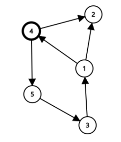
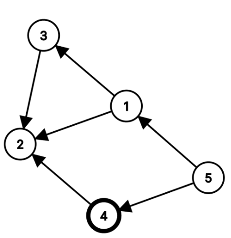

# 문제
구름이가 사는 구름 나라는 N개의 섬으로 이루어져 있다. 각 섬에는 1부터 N까지의 번호가 붙어 있고, 구름 나라는 사람들이 섬과 섬 사이를 편하게
이동할 수 있도록 다리를 M 개 설치했다. <br/>
설치된 다리들은 아래의 특징들을 만족한다. <br/>
* 모든 다리는 단방향으로만 이동 가능하다.
* 다리가 잇는 두 섬은 항상 다른 섬이다.

구름이는 현재 K번 섬에 있고, 다른 섬들을 둘러본 뒤 다시 K번 섬으로 돌아오려고 한다. 그렇지만 오래 돌아다니는 것은 피곤한 일이기 때문에,
구름이는 최소한의 섬만 거치는 경로를 택할 것이다. 구름이를 도와 최소 몇 개의 섬을 거쳐서 원래 구름이가 있던 섬으로 돌아올 수 있을지 알아보자.

단, 구름이는 K번 섬 이외에 최소 하나 이상의 다른 섬을 방문해야 한다.

<br/>

# 예제 설명
첫 번째 예제에서는 아래와 같이 구름 나라의 섬과 다리가 배치되어 있다. 구름이는 현재 4번 섬에 있다.



<br/>

4번 섬에서 출발한 구름이는 2번과 5번 섬으로 이동할 수 있다. <br/>
2번 섬으로 이동한 구름이는 더 이상 이동할 수 없지만, 5번 섬으로 이동한 구름이는 3번과 1번 섬을 거쳐서 다시 4번 섬으로 돌아올 수 있다.
이 경우 총 4개의 섬을 통과했다. <br/>

두 번째 예제에서는 아래와 같이 구름 나라의 섬과 다리가 배치되어 있다. 구름이는 현재 4번 섬에 있다.




4번 섬에서 출발한 구름이는 2번 섬으로 이동할 수 있고, 2번 섬에서는 다른 섬으로 이동할 수 없다. 따라서 다시 4번 섬으로 돌아오는 것은
불가능하고, -1을 출력해야 한다.


# 입력
첫째 줄에 섬의 개수 N(2 ≤ N ≤ 10 000) 과 다리의 개수 M(1 ≤ M ≤ 50000) 과 구름이가 있는 섬의 번호 K(1 ≤ K ≤ N)
가 공백을 두고 주어진다. <br/>
둘째 줄부터 M개의 줄에 걸쳐서 a b(1 ≤ a b ≤ N, a ≠ b) 형태로 다리의 상태가 주어진다. 이는 4번 섬에서 6번 섬으로 갈 수 있는 다리가
존재함을 의미한다. 동일한 시작 섬과 도착 섬을 잇는 다리가 주어지지 않는다. <br/>
입력에서 주어지는 모든 수는 정수이다.

<br/>

# 출력
K번 섬에서 출발한 구름이가 최소 몇 개의 섬을 거쳐서 다시 K번 섬으로 도착할 수 있는지 출력하시오. 만약 구름이가 다시 돌아올 수 없다면 -1을
출력하시오.

<br/>

----

<br/>

## 입/출력 예시

### **예시1**

#### 입력

```
5 6 4
1 2
1 3
3 2
4 2
5 1
5 4
```
#### 출력
```
-1
```

### **예시2**

#### 입력

```
5 6 4
1 2
1 4
3 1
4 2
4 5
5 3
```
#### 출력
```
4
```