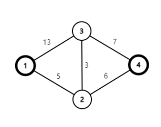
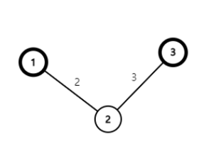

# 문제
구름이는 이상한 미로에 갇혔다. 미로는 N개의 방과 M 개의 복도로 이루어져 있고, 각 방에는 1부터 N까지의 번호가 붙어 있다. 그리고 각
방의 바닥에는 1부터 10 사이의 정수 A 가 쓰여있다. <br/>

이 이상한 미로에는 이상한 규칙들이 있다. <br/>

* 방에서 움직이는 데 걸리는 시간은 고려하지 않는다.
* 미로에 있는 모든 복도는 양방향으로 이동할 수 있고, 복도마다 지나가는 데 걸리는 시간이 정해져 있다.
* i번 방과 j번 방이 복도로 직접 연결되어 있고, j번 방과 K번 방이 복도로 직접 연결되어 있을 때, 두 복도를 이용해 번 방에서 K번 방으로
이동하려면 i를 Aj로 나눈 나머지와 k를 Aj로 나눈 나머지가 같아야 한다.

<br/>

구름이는 현재 1번 방에 있고, 탈출구는 N번 방에 있다. 구름이가 이 이상한 미로에서 탈출할 수 있는지, 탈출할 수 있다면 구름이가
탈출하기까지 최소 얼마나 시간이 걸리는지 구해보자. 단, 맨 처음에 이용하는 복도는 위의 조건과는 상관 없이 원하는 복도를 이용할 수 있다.

<br/>

# 예제 설명
첫 번째 예시에 나온 미로를 그림으로 나타내면 아래와 같다.




<br/>

우선, 1번 방에서 처음 출발할 때는 `1>3` 복도나 `1>2` 복도 중 아무 복도나 이용할 수 있다. 그러나 `1>2>4` 와 같이 이동하는 것은
불가능한데, 왜냐하면 1을 A2로 나눈 나머지와 4를 A2로 나눈 나머지가 1과 ()으로 서로 다르기 때문이다. <br/>
위의 미로 형태에서 조건을 만족하는 최단 경로는 `1>2>3>4` 이고, 이때 걸리는 시간은 5+3+7= 15 이다. <br/>
두 번째 예시에 나온 미로를 그림으로 나타내면 아래와 같다.




`1>2>3` 과 같이 이동하는 것은 불가능하다. 1과 3을 각각 A2로 나눈 나머지가 1과 3으로 서로 다르기 때문이다. 따라서 위의 미로에서는
1번 방에서 3번 방에 도달하는 것이 불가능하고, -1을 출력해야 한다.

<br/>

# 입력
첫째 줄에는 이상한 미로에 있는 방의 개수 N(3 ≤ N ≤ 100 000), 복도의 개수 M (0 ≤ M ≤ 200 000)이 공백으로 구분되어
주어진다. <br/>

두 번째 줄에는 N개의 정수 A1, A2, ..., AN이 공백으로 구분되어 주어진다. A는 i번 방의 바닥에 적혀있는 수를 의미한다. <br/>

다음 M개의 줄에는 한 줄에 하나씩 복도의 정보를 의미하는 세 정수 u, v, w가 공백으로 구분되어 주어진다. 나와 (1 ≤ u v ≤ N)는
복도가 연결하고 있는 두 방의 번호를 의미하고, W(1 ≤w ≤ 10^9)는 그 복도를 통과하는 데 걸리는 시간을 의미한다.


<br/>

# 출력
구름이가 어떤 경로를 이용하더라도 N 번 방에 도달할 수 없다면 -1을 출력한다. <br/>
그렇지 않다면 N 번 방에 도달하는 데 필요한 최소 시간을 출력한다.

<br/>

----

<br/>

## 입/출력 예시

### **예시1**

#### 입력

```
4 5
3 2 1 5
1 2 5
2 4 6
2 3 3
1 3 13
4 3 7
```
#### 출력
```
15
```

### **예시2**

#### 입력

```
3 2
5 6 3
1 2 2
2 3 3
```
#### 출력
```
-1
```


### **예시3**

#### 입력

```
3 0
10 10 10
```
#### 출력
```
-1
```